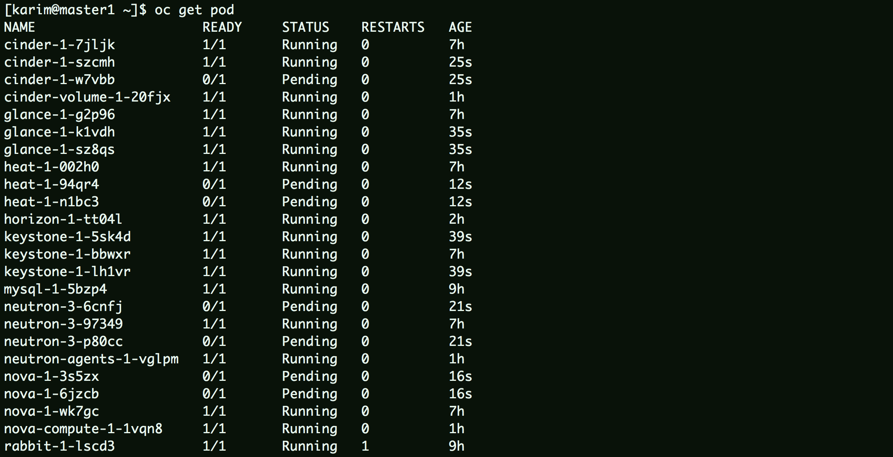
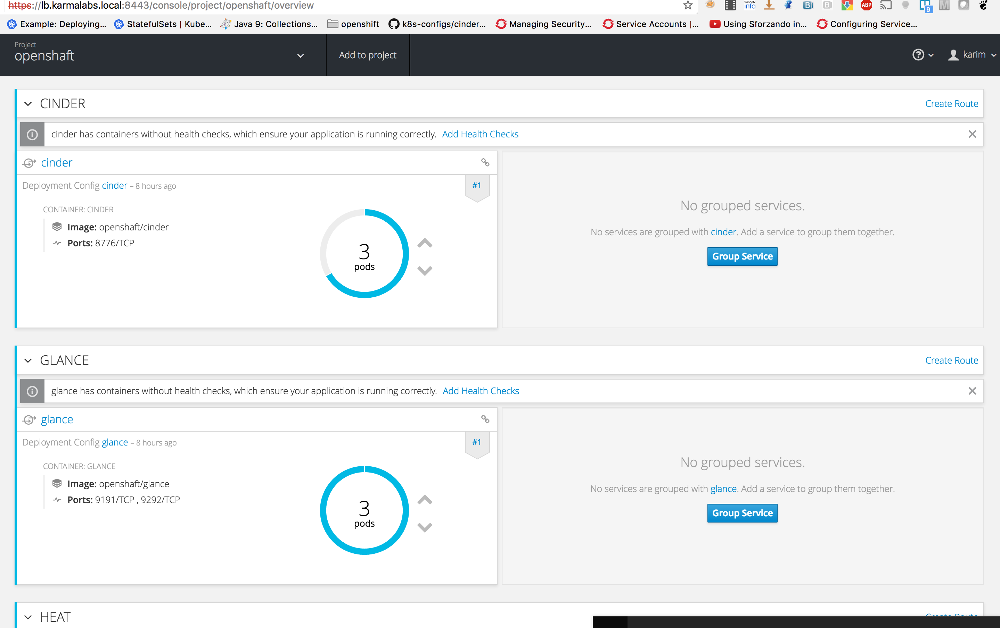

# OPENSHAFT repository

[](https://travis-ci.org/karmab/openshaft)

Ansible role to deploy custom openstack containers for each component and run on single *docker* or  *openshift/kubernetes*

- keystone
- glance
- cinder
- cinder-volume
- neutron
- neutron-agents
- nova
- nova-compute
- heat
- swift
- swift-storage
- db-upgrader ( if willing to run updates)

## COOL SCREENSHOTS





## INITIALISATION

The idea is to use a dedicated vm to build containers and to optionally push them to openshift.
You can also use this same machine to run all those containers


to tweak settings, create a *host_vars/localhost* file copying default configuration from *roles/openshat/default/main.yml* 

you also want to export *ANSIBLE\_ROLES\_PATH* so that ansible can access the openshaft role

## BUILD ALL COMPONENT IMAGES

```
ansible-playbook playbooks/centos.yml
```

## BUILD SPECIFIC COMPONENT IMAGE

You can use tagging for this. For instance, to only build keystone image:

```
ansible-playbook playbooks/centos.yml  -t keystone
```

## RUN HELPER CONTAINERS

I use existing mysql and rabbit containers

```
docker run --name mysql -p 3306:3306 -e MYSQL_ROOT_PASSWORD=mysql -d mysql:latest
docker run --name rabbit -p 5672:5672 -d --hostname rabbit -e RABBITMQ_DEFAULT_USER=guest -e RABBITMQ_DEFAULT_PASS=guest rabbitmq:3-management
```

also add this */etc/host entry* for local testing if on MacosX

```
172.17.0.1 mysql keystone rabbit rabbitmq glance cinder neutron nova heat ceilometer swift
```

If running on linux, the indicated trick doesnt work, instead you ll want to append the following to your docker run commands

```
--add-host mysql:172.17.0.1 --add-host keystone:172.17.0.1 --add-host rabbit:172.17.0.1 --add-host glance:172.17.0.1 --add-host cinder:172.17.0.1 --add-host neutron:172.17.0.1 --add-host nova:172.17.0.1 --add-host heat:172.17.0.1 --add-host ceilometer:172.17.0.1 --add-host nfs:172.17.0.1
```


## RUN API CONTAINERS

```
docker run -d --name keystone -p 5000:5000 -p 35357:35357 openshaft/keystone
docker run -d --name glance -p 9191:9191 -p 9292:9292 -v /tmp/openshaft/glance_data:/var/lib/glance openshaft/glance
docker run -d --name cinder -p 8776:8776 openshaft/cinder
docker run -d --name neutron -p 9696:9696 openshaft/neutron
docker run -d --name nova -p 6080:6080 -p 8773:8773 -p 8774:8774 -p 8775:8775 openshaft/nova
docker run -d --name heat -p 8000:8000 -p 8003:8003 -p 8004:8004 openshaft/heat
docker run -d --name horizon -p 80:80 -p 443:443 openshaft/horizon
docker run -d --name swift -p 8080:8080 openshaft/swift
```

## RUN PRIVILEGED CONTAINERS

If using an nfs cinder backend:

```
docker run --privileged -d --name cinder-volume openshaft/cinder-volume
```
If using a lvm backend, also add *-v /dev:/dev* and make sure to precreate a VG called cinder-volumes on the host

for neutron openvswitch, make sure openvswitch is loaded on the host (and selinux disabled)
for neutron agents, make sure to set a proper hostname to the container as routers are tagged with indicated hostname and only launched on corresponding l3 server
Alternatively, you can enable l3 ha

```
docker run --privileged -d --name neutron-agents --hostname neutron-agents openshaft/neutron-agents
```

for nova-compute, you might need to start ( and enable) ip6tables service on host to prevent neutron errors when booting instance
also under investigation, running the following in the container:

```
##chown root.kvm /dev/kvm
chmod 666 /dev/kvm
```

```
docker run --privileged -d --name nova-compute openshaft/nova-compute
```

```
docker run --privileged -v /dev/vdb:/dev/vdb -d --name swift-storage -p 6200:6200 -p 6201:6201 -p 6202:6202 openshaft/swift-storage"
```

## HANDLING EXTERNAL CONNECTIVIY WHEN TESTING ON DOCKER

on the docker host

```
brctl addbr external
brctl addif external eth1
ip link add int type veth peer name ext
brctl addif external ext
ip link set netns `docker inspect --format '{{.State.Pid}}' neutron-agents` int
ip link set eth1 up
ip link set ext up
ip link set external up
echo net.ipv4.conf.all.rp_filter=0 >> /etc/sysctl.d/99-sysctl.conf
echo net.ipv4.conf.default.rp_filter=0 >> /etc/sysctl.d/99-sysctl.conf
sysctl -p /etc/sysctl.conf
```

on the neutron-agents container 

```
ovs-vsctl add-port br-ex int
ip link set int up
ip link set br-ex up
```

## RUN CLIENT CONTAINER

every image is built with bash and a keystonerc_admin you can use for testing

## FORCING REBUILD of a container

```
rm -rf $ROOTDIR/$COMPONENT/Dockerfile
```

## OPENSHIFT

additional details for openshift can be found [here](https://github.com/karmab/openshaft/tree/master/OPENSHIFT.md)

## TODO LIST

- find root cause for this error on nova compute: *ERROR neutron.plugins.ml2.drivers.openvswitch.agent.ovs_neutron_agent ProcessExecutionError: Exit code: 255; Stdin: ; Stdout: ; Stderr: sysctl: cannot stat /proc/sys/net/bridge: No such file or directory*
- create openshift templates for routes and service accounts
- switch to stateful sets to name the neutron-agents deterministically ?
- enable pushing to docker registry by mean of a service account
- use ansible to gather openshift token and cert
- add labels to schedule nova-compute or swift-storage on specific nodes
- translate the veth pair in openshift world ( or use a cron on compute nodes to do the same?)
- add missing ifaces to bridge so they get added by namespace later or only detected ones ?
- evaluate use of net=host for openvswitch related containers
- test along with ovn and contiv
- review if it makes sense to push images to docker hub
- overwrite bridge mappings on a per compute ( or neutron-agent) base
- test with ocata and probably adjust some packages ( nova-placement-api )
- use reasonable defaults for most existing variables to ease maintenance of the conf files
- switch to transport_url from ocata onwards

## Problems?

Send me a mail at [karimboumedhel@gmail.com](mailto:karimboumedhel@gmail.com) !

Mac Fly!!!

karmab
